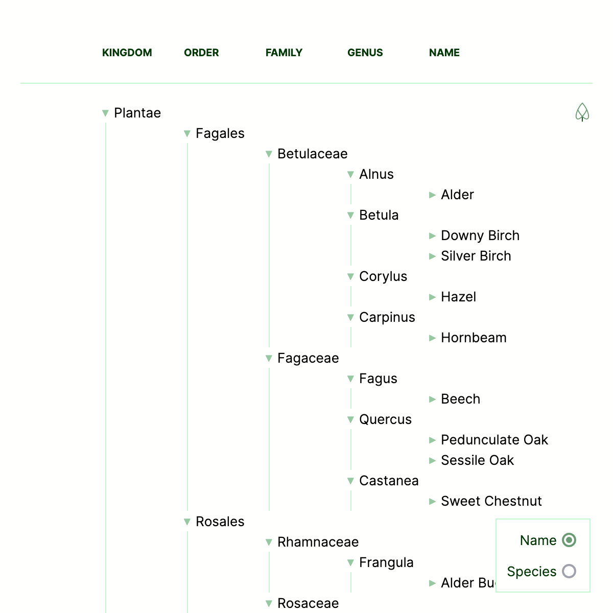

React is ideally suited to the task of creating [trees](https://en.wikipedia.org/wiki/Tree_(data_structure)) being at its core, a tree of functions that call one another. In this demo we’ll look at creating a tree using a data set containing trees (of the Kingdom Plantae). Here’s the [demo](https://robstarbuck.github.io/treact/) that we are working towards.



**DISCLAIMER** I opted for trees because I want to learn more about them, this was not done out of a desire to bend minds by creating a tree of trees with a tree of functions though I admit this amuses me. 

# Flat vs Nested Data

As our subject is trees it’s their taxonomic rank that we’ll be exploring. There are many but we'll be using only a subset:

1. Kingdom
2. Order
3. Family
4. Genus
5. Species (or Common Name)

So an ash tree would come out as

```plain
*1. Plantae
	2. Lamiales
		3. Oleaceae
			4. Fraxinus
				5. Fraxinus excelsior (Ash)*
```

One common way to represent tree data is to nest the containing information. 

```json
[
  {
    "taxon": "Kingdom",
    "value": "Plantae",
    "children": [
      {
        "taxon": "Order",
        "value": "Lamiales",
        "children": [
          {
            "taxon": "Family",
            "value": "Oleaceae",
            "children": [
              {
                "taxon": "Genus",
                "value": "Fraxinus",
                "children": [
                  {
                    "taxon": "Species",
                    "value": "Fraxinus excelsior",
                    "children": []
                  }
                ]
              }
            ]
          }
        ]
      }
    ]
  }
]
```

Whilst this seems a natural fit it has many disadvantages.

1. The shape of the data is hard to work with, finding a leaf node (a tree) requires recursion.
2. Each datum has no idea of its context, eg a species only knows its genus by knowing its parent.
3. The hierarchy is very rigid, if we only want to look at everything beneath families we still need to go through the root *Plantae*.

A more flexible approach is to keep our data flat. In this instance we already know the levels of our tree (the taxonomic ranks we’ll be using), this might not be true for other trees. A family tree for example could span any number of generations. Here however our levels are known.

- Kingdom
- Order
- Family
- Genus
- Species

As such the ash tree can be easily represented:

```json
{
  "Kingdom": "Plantae",
  "Order": "Lamiales",
  "Family": "Oleaceae",
  "Genus": "Fraxinus",
  "Species": "Fraxinus excelsior"
}
```

Certainly much easier to grok from my point of view and I’ll demonstrate further advantages later on. With out schema agreed upon (well I’m happy with it), let’s render it out in react.

# A Basic Implementation

We can get a basic implementation working in 50 or so (readable) lines of Typescript.

```tsx

import "./App.css";
import { FC } from "react";
import allTrees from "./data.json";

// Types
type Tree = typeof allTrees[number];
type TaxonomicRank = keyof Tree;
type TaxonomyProps = { children: Array<Tree>; rank: TaxonomicRank }

// This is only a subset of - domain, kingdom, phylum, class, order, family, genus, species
const taxonomicRanks: Array<TaxonomicRank> = [
  "Kingdom",
  "Order",
  "Family",
  "Genus",
  "Species"
];

// Our recursive taxonomy which calls itself where child taxonomies exist
const Taxonomy: FC<TaxonomyProps> = (props) => {
  const { children, rank } = props;

  // Find the unique taxa in our child taxonomies
  // EG unique taxa with a key of "Genus"
  const taxaInRank = children.reduce<Array<Tree>>((a, c) => {
    if (a.find((v) => v[rank] === c[rank])) {
      return a;
    }
    return [...a, c];
  }, []);

  return (
    <div>
      {/* Loop through the taxa in the rank */}
      {taxaInRank.map((taxon) => {
        // Crucially we are only passing the taxa of this rank to the next Taxonomy
        // Without this filter, the component will call itself indefinitely
        const childrenOfTaxon = children.filter(
          (t) => t[rank] === taxon[rank]
        );
        // By using the .at method typescript includes undefined in the type
        // should our index not be in the array
        // https://www.typescriptlang.org/play?target=9&ts=4.6.2#code/MYewdgzgLgBFDuIAyBTKUUCcIwLwwG0ByAQSIBoYiAhIgXQG4BYAKFYHp2ZRJYoALAJaYAJqnRYAXDGiZBYAOase0OENHiMmPHESasEAgCZGrDlxV91YtFpJRps+QpgAfGAFcwIlADN5KCLK4KoCwjYSmPY6CMi2BgB0AIZQABRGAJRAA
        const subRank = taxonomicRanks.at(taxonomicRanks.indexOf(rank) + 1);
        return (
          // For those unfamilar with the element
          // https://developer.mozilla.org/en-US/docs/Web/HTML/Element/details
          <details open>
            <summary>
              {taxon[rank]}
            </summary>
            {/* Should a subRank exist then render our taxonomy */}
            {/* The element calls itself */}
            {subRank && <Taxonomy rank={subRank}>{childrenOfTaxon}</Taxonomy>}
          </details>
        );
      })}
    </div>
  );
};

function App() {
  return (
    <div className="App">
      {/* Our initial call to our Taxonomy */}
      <Taxonomy rank={taxonomicRanks[0]}>{allTrees}</Taxonomy>
    </div>
  );
}

export default App;
```
Here’s the same code on [github](https://github.com/robstarbuck/treact/blob/basic/src/App.tsx). 

With a some bare minimum CSS we already have our tree rendering ever level of our taxa up to the tree itself, our leaf node.


# Improvements

Because we’ve kept our schema flat by abstracting the keys (in this case taxonomic ranks) we can modify which taxonomic ranks we iterate over. Currently we are recursing through "Kingdom", "Order", "Family", "Genus", "Species”. If we only want to observe the “Species” though this can easily be achieved by passing to our initial Taxonomy. 

```tsx
function App() {
  const rank = "Species";
  return (
    <div className="App">
      {/* Our initial call to our Taxonomy */}
      <Taxonomy rank={rank}>{allTrees}</Taxonomy>
    </div>
  );
}
```

With this in mind, it’s easy to see how `rank` may be stateful to allow users to limit the ranks being viewed.

We can also opt to observe different keys of our trees, for instance Species is probably not all that useful to most people who know trees by their common names.

```json
{
    "Name": "Ash",
    "Species": "Fraxinus excelsior"
    // ...
}
```

Again, this is easily toggled by switching between two different taxa.

```tsx
const taxaByName: Array<TaxonomicRank> = [
  "Kingdom",
  "Order",
  "Family",
  "Genus",
  "Name",
];

const taxaBySpecies: Array<TaxonomicRank> = [
  "Kingdom",
  "Order",
  "Family",
  "Genus",
  "Species",
];
```

The complete source code for this project can be found in the [repo](https://github.com/robstarbuck/treact/).

# Summary

Even when everything in your repo is screaming “TREE!” keeping data flat can prove infinitely more flexible. In this instance we knew our groups in advance, where this might not be the case extra keys might indicate relationships between nodes.

```tsx
[
    // ...
    {
        "id": "LETOTHEJUST",
        "fatherId": "THEOLDDUKE",
        "name": "Paul Attreides"
    },
    {
        "id": "MUADDIB",
        "fatherId": "LETOTHEJUST",
        "name": "Paul Attreides"
    },
    {
        "id": "STALIAOFTHEKNIFE",
        "fatherId": "LETOTHEJUST",
        "name": "Alia Attreides"
    }
]
```

Of course in an ordinary family tree there is more than one parent, I’ll skip over that.

Owing to it’s nature Recursive Components are a really great fit for React, implementations that I’ve seen in Vue and Angular aren’t quite as comprehensive.